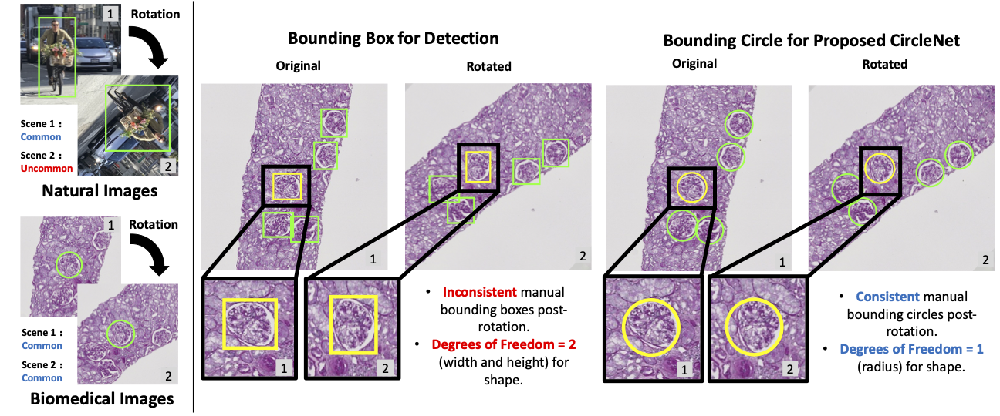

# CircleNet: Anchor-free Detection with Circle Representation
The official implementation of CircleNet, *MICCAI 2020*, *IEEE TMI 2021*



**Journal Paper**
> [**Circle Representation for Medical Object Detection**](https://ieeexplore.ieee.org/document/9585500),                 
> Ethan H. Nguyen, Haichun Yang, Ruining Deng, Yuzhe Lu, Zheyu Zhu, Joseph T. Roland, Le Lu, Bennett A. Landman, Agnes B. Fogo, Yuankai Huo,                      
> *IEEE Transactions on Medical Imaging ([10.1109/TMI.2021.3122835](https://ieeexplore.ieee.org/document/9585500))*; *arXiv ([arXiv:2110.12093](https://arxiv.org/abs/2110.12093))*

**Conference Paper**
> [**CircleNet: Anchor-free Detection with Circle Representation**](https://link.springer.com/chapter/10.1007/978-3-030-59719-1_4),          
> Haichun Yang, Ruining Deng, Yuzhe Lu, Zheyu Zhu, Ye Chen, Joseph T. Roland, Le Lu, Bennett A. Landman, Agnes B. Fogo, Yuankai Huo                                
> *MICCAI 2020*; *arXiv ([arXiv:2006.02474](https://arxiv.org/abs/2006.02474))*

Contact: [ethan.h.nguyen@vanderbilt.edu](mailto:ethan.h.nguyen@vanderbilt.edu). Feel free to reach out with any questions or discussion!  

## Abstract
Box representation has been extensively used for object detection in computer vision. Such representation is efficacious but not necessarily optimized for biomedical objects (e.g., glomeruli), which play an essential role in renal pathology. We propose a simple circle representation for medical object detection and introduce CircleNet, an anchor-free detection framework. Compared with the conventional bounding box representation, the proposed bounding circle representation innovates in three-fold: 

(1) it is optimized for ball-shaped biomedical objects; 

(2) The circle representation reduced the degree of freedom compared with box representation; 

(3) It is naturally more rotation invariant. When detecting glomeruli and nuclei on pathological images, the proposed circle representation achieved superior detection performance and be more rotation-invariant, compared with the bounding box.

## Highlights 

- **Simple:** One-sentence summary: Instead of the conventional bounding box, we propose using a bounding circle to detect ball-shaped biomedical objects.

- **State-of-the-art:** On two datasets (glomeruli and nuclei), our CircleNet method outperforms baseline methods by over 10%.

- **Fast:** Only requires a single network forward pass.

## Installation

Please refer to [INSTALL.md](docs/INSTALL.md) for installation instructions.

## CircleNet - Image Demo
CircleNet can easily be run on a single image or a folder of images.

First, download the models (By default, [circledet_monuseg_hg](https://vanderbilt.box.com/s/is6rg9888idgmgtr59890mbgs5sv56ph) ) from [Model Zoo](docs/MODEL_ZOO.md) and put them in `CircleNet_Root/models`

We provide an example image from [MoNuSeg 2018](https://monuseg.grand-challenge.org/). 

 

For nuclei detection, run 

```
python demo.py circledet --arch hourglass --demo ../docs/demo.png --load_model ../models/circledet_monuseg_hg.pth
```

If set up correctly, the output should look like


To use this CircleNet in your own project, you can 

~~~
import sys
CIRCLENET_PATH = /path/to/CircleNet/src/lib/
sys.path.insert(0, CIRCLENET_PATH)

from detectors.detector_factory import detector_factory
from opts import opts

MODEL_PATH = /path/to/model
TASK = 'circledet'
opt = opts().init('{} --load_model {}'.format(TASK, MODEL_PATH).split(' '))
detector = detector_factory[opt.task](opt)

img = image/or/path/to/your/image(s)/
ret = detector.run(img)['results']
~~~
`ret` will be a Python list: `[x, y, radius, confidence, category]`

## CircleNet - Whole Slide Image Demo
CircleNet can also be run on Whole Slide Images in *.scn file format.

Please download the following two files:

1. [Human Kidney WSI](https://vanderbilt.box.com/s/s530m45rvk626xi1thwcdc2bhoea758r)

2. [Human Kidney Model](https://vumc.box.com/s/wpar2kz9600h9ao3wowjzc3y50znneop)

To run it on a testing scan, please go to "src" folder and run

```
sudo apt install python-openslide
python run_detection_for_scn.py circledet --arch dla_34 --demo "/media/huoy1/48EAE4F7EAE4E264/Projects/from_haichun/batch_1_data/scn/Case 03-1.scn" --load_model /media/huoy1/48EAE4F7EAE4E264/Projects/detection/CircleNet/exp/circledet/kidpath_dla_batch4/model_10.pth --filter_boarder --demo_dir "/media/huoy1/48EAE4F7EAE4E264/Projects/detection/test_demo"
```

The demo_dir is output dir, which you set anywhere in your computer.

After running the code, you will see a `Case 03-1.xml` file.
Put the xml and scn files into the same folder, and open the scn file using [ImageScope software](https://www.leicabiosystems.com/digital-pathology/manage/aperio-imagescope/) (only avilable in Windows OS). You should see something like the following image, with green detection results.

 

A Google Colab version of above can be found [here](https://github.com/hrlblab/CircleNet/blob/master/src/circle_net_demo.ipynb).

## Benchmark Evaluation and Training

After [installation](docs/INSTALL.md), follow the instructions in [DATA.md](docs/DATA.md) to setup the datasets. Then check [GETTING_STARTED.md](docs/GETTING_STARTED.md) to reproduce the results in the paper.
We provide scripts for all the experiments in the [experiments](experiments) folder.

## Develop

If you are interested in training CircleNet in a new dataset, use CircleNet in a new task, or use a new network architecture for CircleNet please refer to [DEVELOP.md](docs/DEVELOP.md). Also feel free to send us emails for discussions or suggestions.

## License

CircleNet itself is released under the MIT License (refer to the LICENSE file for details).
Parts of code and documentation are borrowed from [CenterNet](https://github.com/xingyizhou/CenterNet).
We thank them for their elegant implementation.

## Citation
If you find this project useful for your research, please use the following BibTeX entry.

    @article{nguyen2021circle,
      title={Circle Representation for Medical Object Detection},
      author={Nguyen, Ethan H and Yang, Haichun and Deng, Ruining and Lu, Yuzhe and Zhu, Zheyu and Roland, Joseph T and Lu, Le and Landman, Bennett A and Fogo, Agnes B and Huo, Yuankai},
      journal={IEEE Transactions on Medical Imaging},
      year={2021},
      publisher={IEEE}
    }
